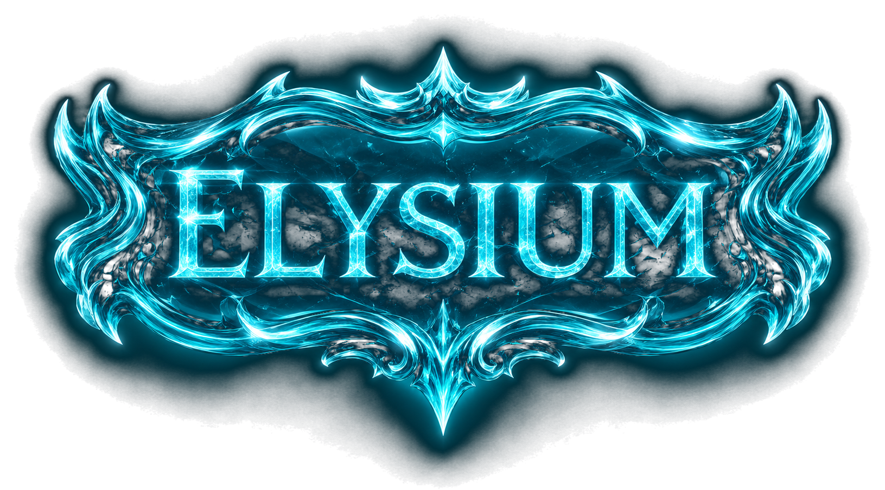
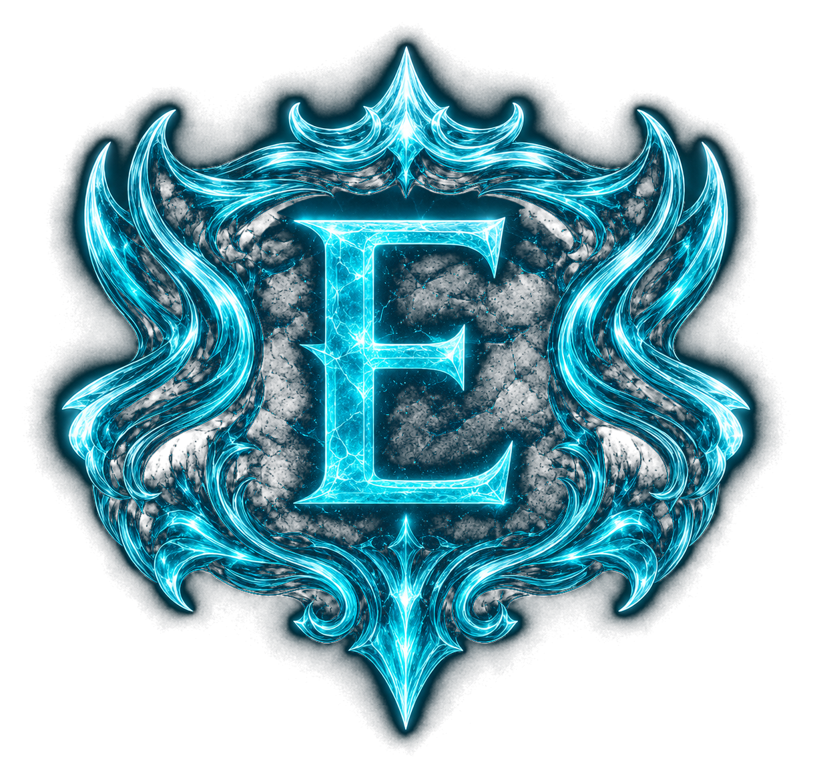

# ❄️ Elysium RSPS Website

<p align="center">
  
</p>

<p align="center">
  <strong>An icy glassmorphism website starter for an unofficial semi-custom RSPS community.</strong>
</p>

<p align="center">
  
  
  
  
</p>

---

## ✨ About Elysium

**Elysium** is a clean, modern website starter designed for an unofficial RSPS community.

The theme uses a dark icy fantasy style with glassmorphism panels, glowing cyan accents, smooth animations, mobile-first spacing, and polished sections for a private server website.

This project is built to feel premium without overselling the server as a full custom fantasy MMO. It is designed around a more accurate RSPS presentation:

- Unofficial RSPS
- Semi-custom gameplay
- PvM and bossing
- Skilling and progression
- PvP and wilderness activity
- Economy and trading
- Discord/community support
- Launcher/download links
- News and updates

---

## 🧊 Preview

<p align="center">
  
</p>

The website includes:

- Icy glassmorphism design
- Animated snow/particle background
- Mobile navigation
- Smooth reveal animations
- Server status card
- Player-count placeholder
- Download section
- Community section
- News/update cards
- Fully responsive layout

---

## 📁 Project Structure

```text
Elysium/
├── index.html
├── README.md
├── assets/
│   ├── elysium-logo.png
│   └── elysium-icon.png
├── partials/
│   ├── header.html
│   ├── hero.html
│   ├── about.html
│   ├── features.html
│   ├── play.html
│   ├── download.html
│   ├── news.html
│   ├── community.html
│   └── footer.html
├── css/
│   ├── main.css
│   ├── variables.css
│   ├── base.css
│   ├── layout.css
│   ├── components.css
│   └── responsive.css
└── js/
    ├── main.js
    ├── partials.js
    ├── nav.js
    ├── reveal.js
    ├── playerCount.js
    └── snow.js
```

---

## 🚀 Quick Start

### 1. Upload the files

Upload the full project folder to one of the following:

- GitHub Pages
- Netlify
- Vercel
- Cloudflare Pages
- Any standard web host

### 2. Keep the structure the same

The modular version loads HTML sections from the `partials/` folder, so the folder names and paths matter.

Do not rename these unless you also update the paths in `index.html`.

### 3. Open the website

Once hosted, visit your live site URL.

Example:

```text
https://yourusername.github.io/your-repo-name/
```

---

## ⚠️ Important Local Testing Note

Because this version loads HTML partial files with JavaScript `fetch()`, it should be viewed through a web server.

Do **not** test it by double-clicking `index.html`.

Use one of these instead:

### VS Code Live Server

Install the **Live Server** extension, then right-click `index.html` and choose:

```text
Open with Live Server
```

### Python local server

From the project folder, run:

```bash
python -m http.server 8000
```

Then open:

```text
http://localhost:8000
```

---

## 🎨 Theme Details

The visual style is built around:

| Element | Style |
|---|---|
| Primary color | Icy cyan |
| Background | Dark blue/black fantasy atmosphere |
| Panels | Glassmorphism |
| Logo style | Frosted glowing emblem |
| Motion | Smooth reveal animations |
| Effects | Snow/particle canvas |
| Layout | Mobile-first responsive sections |

Main theme colors are stored in:

```text
css/variables.css
```

You can quickly change the theme by editing:

```css
--ice: #37f7ff;
--ice-2: #9effff;
--bg: #02080d;
--text: #f0feff;
--muted: #9fc5ce;
```

---

## 🧩 Current Website Sections

### Header

The header includes:

- Elysium icon
- Elysium brand text
- Mobile hamburger menu
- Navigation links

Located in:

```text
partials/header.html
```

---

### Hero Section

The hero section includes:

- Unofficial RSPS badge
- Semi-custom badge
- Full Elysium logo
- Main headline
- Short server description
- Play Now button
- Join Discord button
- Highlight badges

Located in:

```text
partials/hero.html
```

---

### Server Status Card

The current server card is a placeholder.

It includes:

- Mock player count
- Hosted status
- PvM focus
- Economy status

The mock player count is handled in:

```text
js/playerCount.js
```

Later, this can be connected to a real API.

---

### Features

The feature section is designed for common RSPS selling points:

- PvM and bossing
- Semi-custom progression
- Player economy
- PvP
- Skilling
- Highscores

Located in:

```text
partials/features.html
```

---

### Download Section

The download section includes placeholder buttons for:

- Windows
- Mac
- Linux

Located in:

```text
partials/download.html
```

Replace the `href="#"` values with your real launcher download links.

---

### Community Section

The community section is designed for:

- Discord
- Vote links
- Rules
- Wiki
- Forums
- Support tickets
- Staff page

Located in:

```text
partials/community.html
```

---

## 🔌 Future API Ideas

This static site can later connect to a backend API for live RSPS data.

Useful future endpoints could include:

```text
/api/status
/api/players-online
/api/news
/api/hiscores
/api/votes
/api/downloads
```

Possible live features:

- Real player count
- World online/offline status
- Latest news posts
- Launcher version
- Highscores
- Vote rewards
- Discord member count
- Staff announcements

---

## 🏆 Suggested Next Pages

Recommended pages to add next:

```text
pages/
├── highscores.html
├── vote.html
├── download.html
├── rules.html
├── wiki.html
├── store.html
├── staff.html
└── support.html
```

Best next upgrades:

1. **Highscores page**
2. **Vote page**
3. **Launcher download page**
4. **Discord widget**
5. **Rules page**
6. **News/admin system**
7. **Live server status API**
8. **Account login panel**

---

## 🛠️ Editing Guide

### Change the main headline

Edit:

```text
partials/hero.html
```

Find:

```html
<h1>A clean semi-custom RSPS built for grinding.</h1>
```

---

### Change the download buttons

Edit:

```text
partials/download.html
```

Replace:

```html
href="#"
```

With your real download URLs.

---

### Change the Discord button

Edit:

```text
partials/community.html
```

Replace:

```html
href="#"
```

With your Discord invite link.

---

### Change theme colors

Edit:

```text
css/variables.css
```

---

### Change animations

Edit:

```text
js/reveal.js
js/snow.js
```

---

## 📱 Mobile Ready

The site is designed to work well on:

- Android
- iPhone
- Tablets
- Desktop
- GitHub Pages mobile preview
- Chrome mobile browser

Responsive behavior is handled in:

```text
css/responsive.css
```

---

## 🌐 Hosting on GitHub Pages

1. Push the project to a GitHub repository.
2. Open the repository on GitHub.
3. Go to:

```text
Settings → Pages
```

4. Under **Build and deployment**, choose:

```text
Deploy from a branch
```

5. Select:

```text
main / root
```

6. Save.

Your site will be published at:

```text
https://yourusername.github.io/your-repo-name/
```

---

## 📌 Roadmap

Planned improvements:

- [ ] Replace placeholder download links
- [ ] Add real Discord invite
- [ ] Add vote page
- [ ] Add highscores page
- [ ] Add rules page
- [ ] Add live player count API
- [ ] Add news system
- [ ] Add launcher version display
- [ ] Add server status API
- [ ] Add staff/admin area
- [ ] Add SEO social preview image
- [ ] Add Open Graph metadata
- [ ] Add favicon/icon sizes
- [ ] Add PWA support

---

## 🧠 Built With

- HTML5
- CSS3
- JavaScript ES Modules
- Responsive design
- Glassmorphism UI
- Canvas particle effects
- GitHub Pages compatible hosting

---

## ⚖️ Disclaimer

Elysium is an unofficial RSPS/private-server community website starter.

This project is not affiliated with, endorsed by, sponsored by, or connected to Jagex, RuneScape, Old School RuneScape, or any official game publisher.

All branding, design, wording, and assets should avoid implying official endorsement or ownership of third-party intellectual property.

---

## ❄️ Elysium

<p align="center">
  <strong>Clean design. Semi-custom gameplay. Community first.</strong>
</p>
